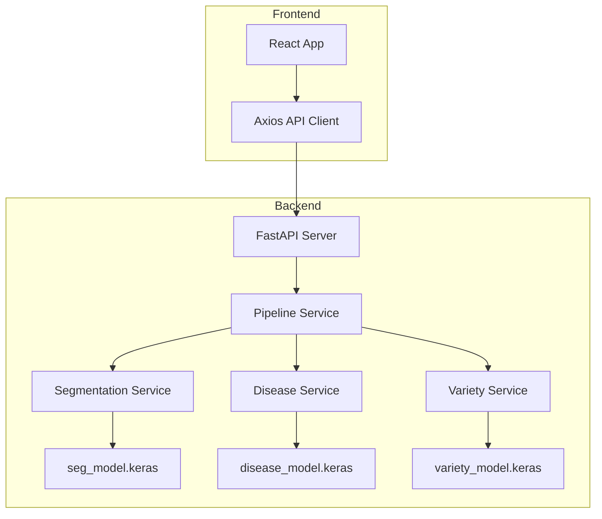

# Rice AI System — Architecture

## Overview

The Rice AI System is a multi-model inference platform that processes rice crop images through three specialized deep learning models:

1. **Segmentation Model** — Identifies and segments rice plant regions from background
2. **Disease Detection Model** — Classifies rice leaf diseases
3. **Variety Classification Model** — Identifies rice varieties (e.g., Basmati, Jasmine)

## System Architecture



## Data Flow

1. User uploads a rice crop image via the frontend
2. Frontend sends the image to the backend API (`POST /api/predict`)
3. The Pipeline Service orchestrates inference:
   - Image is preprocessed (resize, normalize)
   - Segmentation model produces a mask
   - Disease model classifies the leaf condition
   - Variety model identifies the rice type
4. Results are aggregated and returned as structured JSON
5. Frontend renders the results with visualizations

## Model Details

| Model | Input Shape | Output | Architecture |
|-------|-------------|--------|--------------|
| Segmentation | 256×256×3 | 256×256×1 mask | U-Net based |
| Disease | 224×224×3 | Multi-class probabilities | CNN classifier |
| Variety | 224×224×3 | Multi-class probabilities | CNN classifier |

## API Design

All endpoints follow RESTful conventions with JSON responses.

### Response Schema

```json
{
  "success": true,
  "data": {
    "segmentation": { "mask_base64": "..." },
    "disease": { "predicted_class": "...", "confidence": 0.95, "all_predictions": {} },
    "variety": { "predicted_class": "...", "confidence": 0.92, "all_predictions": {} }
  },
  "message": "Prediction completed successfully"
}
```

## Deployment Considerations

- Backend runs on Uvicorn (ASGI server)
- Models are loaded once at startup and cached in memory
- CORS is configured for frontend-backend communication
- Environment variables manage configuration (ports, model paths, etc.)
